# PyME Management Platform and E-commerce – Microservices Architecture

> Web platform for small businesses (PyMEs) to manage products, inventory, orders, and customer interactions using microservices architecture

[Repository Link](https://github.com/Alvaro499/sales-microservices.git)

---

## Table of Contents

- [About The Project](#about-the-project)
- [Built With](#built-with)
- [Architecture](#architecture)
- [Project Structure](#project-structure)
- [Features](#features)
- [Installation](#installation)
  - [Prerequisites](#prerequisites)
  - [Running Locally](#running-locally)
  - [Running with Docker](#running-with-docker)
- [Usage](#usage)
- [Microservices Overview](#microservices-overview)
- [Contact](#contact)

---

## About The Project

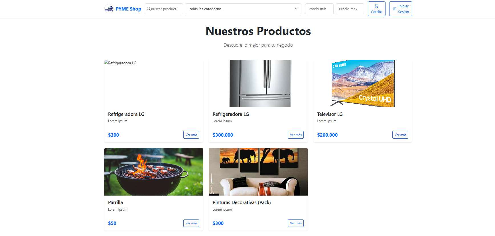

This project was developed as a group project for the Software Engineering course. The main goal was to simulate a real-world system by working as a team and using microservices architecture. The platform allows small PyMEs to manage products, stock, promotions, orders, and user access.

### Why This Project?

- Apply **microservices architecture** to build a scalable system
- Simulate **real-world software development** practices
- Implement **event-driven communication** using Apache Kafka
- Build **independent, loosely coupled services** for better maintainability
- Use **service discovery** with Netflix Eureka
- Develop **both backend and frontend** as separate, independent modules
- Learn **containerization** with Docker
- Implement **authentication and authorization** flows
- Create **comprehensive email notification** systems

**Note:** Each main feature was developed as an independent microservice to improve organization, scalability, and deployment flexibility. The project follows industry best practices for distributed systems.

---

## 🛠 Built With

### Backend Technologies
- **Java 21** - Core programming language
- **Spring Boot 3.4.3** - Application framework
- **Spring Cloud** - Microservices ecosystem
- **Netflix Eureka** - Service discovery and registration
- **Apache Kafka** - Event streaming and message broker
- **PostgreSQL** - Relational database
- **JPA / Hibernate** - ORM for database operations
- **Spring Security** - Authentication and authorization
- **JWT** - Token-based authentication
- **Gradle** - Build automation tool

### Frontend Technologies
- **React 19** - UI library
- **TypeScript** - Type-safe JavaScript
- **Vite** - Build tool and development server
- **Material-UI (MUI)** - Component library
- **Bootstrap 5** - CSS framework
- **React Router** - Client-side routing
- **Axios** - HTTP client
- **SweetAlert2** - For alerts and modals

### Infrastructure
- **Docker** - Containerization
- **Docker Compose** - Multi-container orchestration
- **Zookeeper** - Kafka coordination service

---

## Architecture

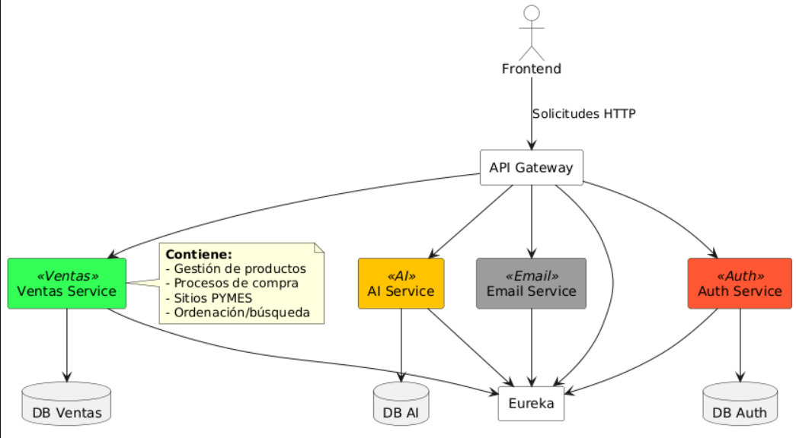

The system follows a **microservices architecture** pattern with the following components:

- **API Gateway**: Single entry point for all client requests
- **Service Registry (Eureka)**: Service discovery and health monitoring
- **Authentication Service**: User authentication, authorization, and JWT token management
- **Sales Service (Ventas)**: Product, order, and inventory management
- **Email Service**: Asynchronous email notifications
- **Event Bus (Kafka)**: Inter-service communication via events

### Communication Patterns

- **Synchronous**: REST APIs for client-server communication
- **Asynchronous**: Kafka events for inter-service messaging
- **Service Discovery**: Eureka for dynamic service location

---

## Project Structure

```
sales-microservices/
│
├── backend/                           # Backend microservices
│   ├── docker-compose.local.yml      # Docker config for local development
│   ├── docker-compose.yml            # Docker config for production
│   │
│   ├── eureka/                       # Service Registry
│   │   ├── src/
│   │   ├── build.gradle.kts
│   │   └── Dockerfile
│   │
│   ├── gateway/                      # API Gateway
│   │   ├── src/
│   │   ├── build.gradle.kts
│   │   └── Dockerfile
│   │
│   ├── authentication-service/       # Authentication & Authorization
│   │   ├── src/
│   │   │   └── main/
│   │   │       ├── java/
│   │   │       └── resources/
│   │   ├── build.gradle.kts
│   │   └── Dockerfile
│   │
│   ├── ventas-back/                  # Sales & Products Service
│   │   ├── src/
│   │   │   └── main/
│   │   │       ├── java/
│   │   │       └── resources/
│   │   ├── build.gradle.kts
│   │   └── Dockerfile
│   │
│   └── email-service/                # Email Notification Service
│       ├── src/
│       ├── build.gradle.kts
│       └── Dockerfile
│
├── frontend/                          # Frontend application
│   └── front-end/
│       ├── src/
│       │   ├── components/
│       │   ├── pages/
│       │   ├── services/
│       │   ├── styles/
│       │   └── App.tsx
│       ├── public/
│       ├── package.json
│       ├── vite.config.ts
│       └── tsconfig.json
│
└── README.md
```

---

## Features

### User Registration & Authentication

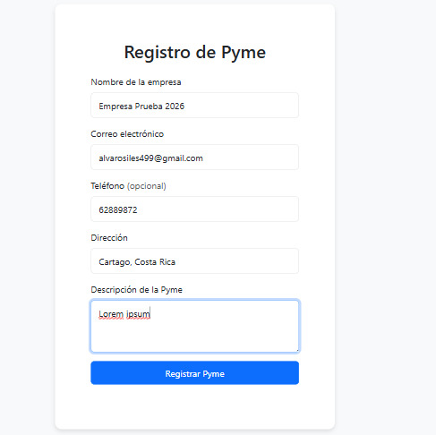

Complete authentication system with email verification, password recovery, and role-based access control.

**Authentication Features:**
- User registration with email verification
- Email verification code system
- Password recovery flow
- JWT-based authentication
- Secure password hashing
- Session management
- Role-based authorization

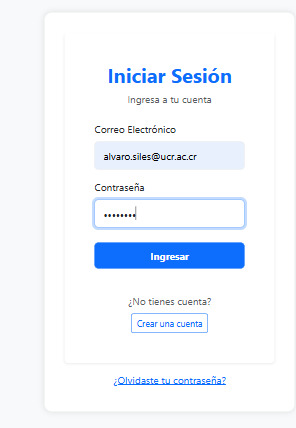

---

### Email Verification System

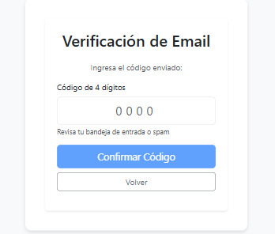

Automated email notifications for account verification and important system events.

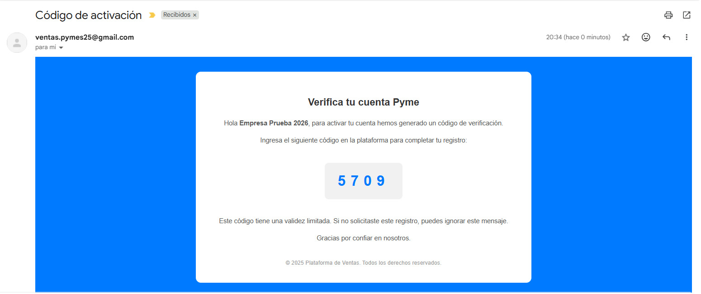

**Email Features:**
- Account verification emails
- Password recovery emails
- Order confirmation emails
- Order status update notifications
- Asynchronous email processing via Kafka

---

### Password Recovery

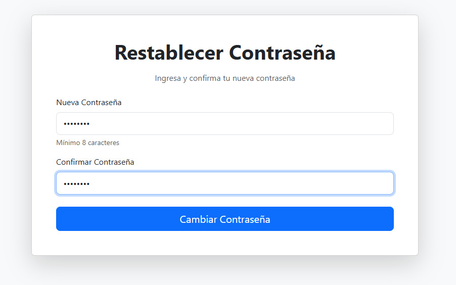

Secure password recovery system with email verification.

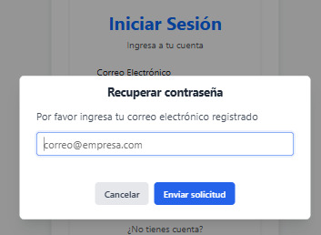

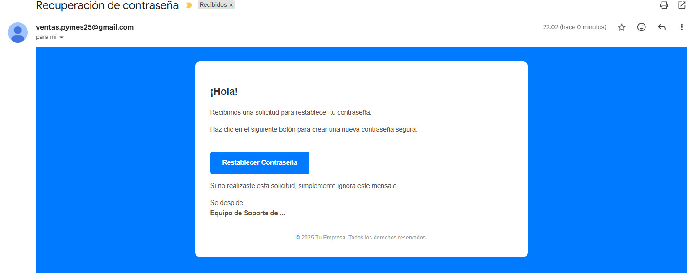

**Recovery Features:**
- Secure token generation
- Email-based verification
- Password reset flow
- Token expiration handling

---

### PyME Admin Dashboard

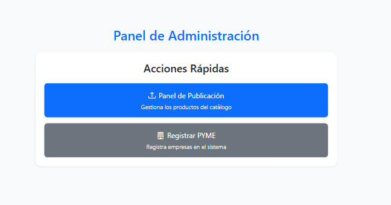

Comprehensive administrative panel for business owners to manage their e-commerce operations.

**Admin Dashboard Features:**
- Product catalog management
- Order processing and tracking
- Inventory control
- Promotions and discounts
- Sales analytics
- Customer management

---

### Product Management

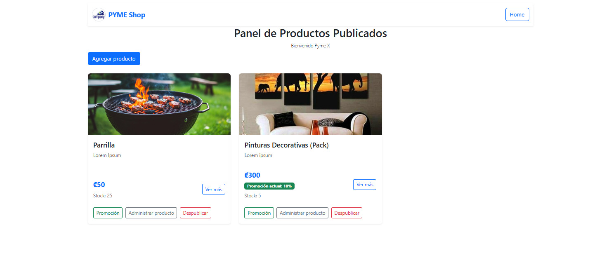

Complete product lifecycle management with categories, pricing, and stock control.

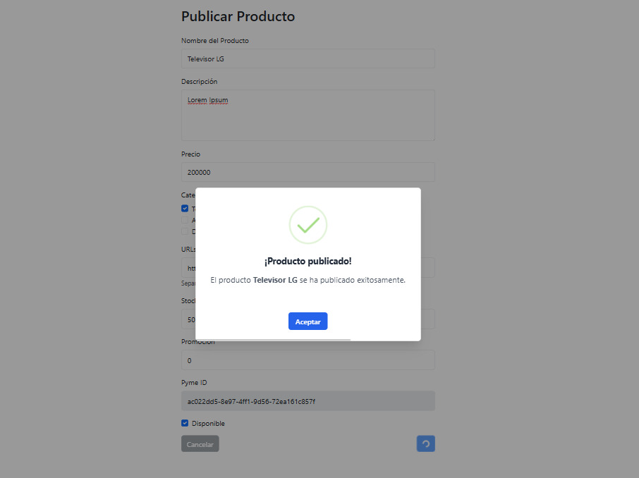

**Product Features:**
- Add, edit, and delete products
- Product images and galleries
- Category management
- Price management
- Stock level tracking
- Product descriptions and details
- Product search and filtering

---

### Stock Management

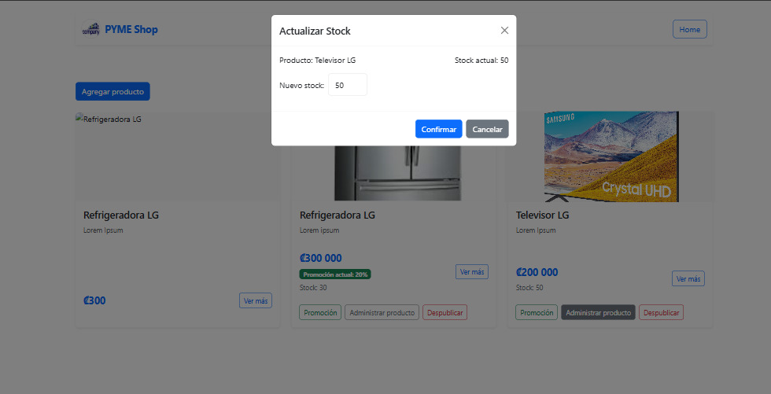

Real-time inventory tracking with low stock alerts.

**Stock Features:**
- Current stock visualization
- Stock adjustment operations
- Low stock alerts
- Stock history tracking
- Multi-location support

---

### Promotions & Discounts

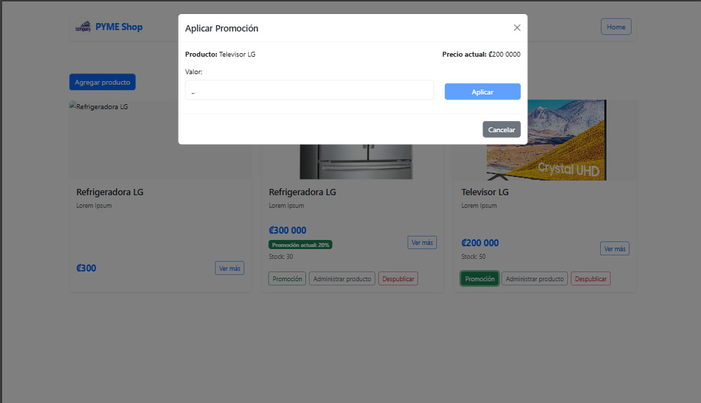

Dynamic promotion system for creating special offers and discounts.

**Promotion Features:**
- Percentage and fixed amount discounts
- Time-based promotions
- Product-specific promotions
- Promotion scheduling
- Automatic price calculation

---

### Public E-commerce Interface


User-friendly shopping experience for customers.

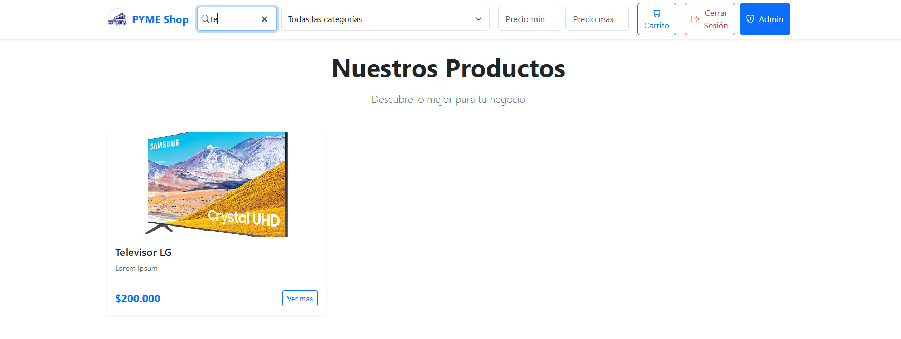

**E-commerce Features:**
- Product browsing and search
- Advanced filtering options
- Product details view
- Shopping cart
- Checkout process
- Order tracking

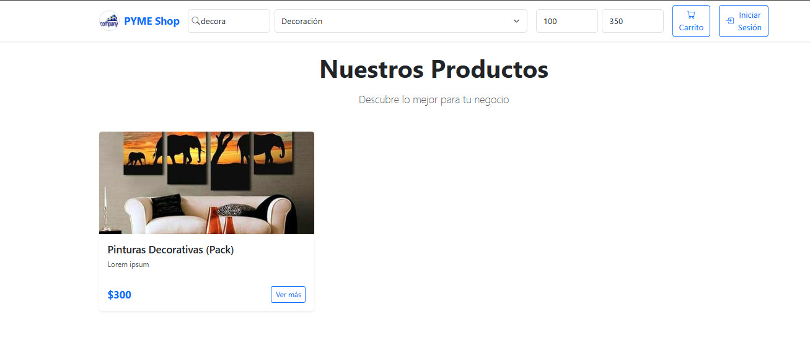

---

### Shopping Cart & Checkout

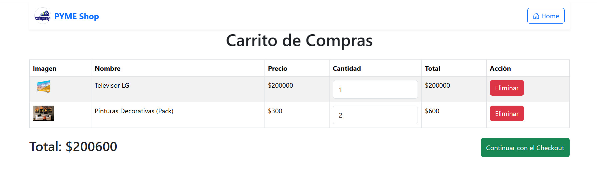

Streamlined checkout process with order confirmation.

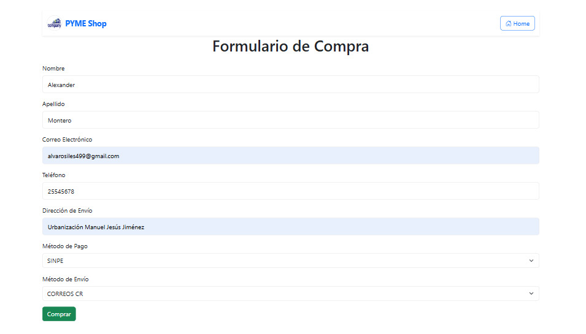

**Cart Features:**
- Add/remove products
- Quantity adjustment
- Real-time price calculation
- Checkout form
- Order summary
- Payment processing (integrated)

---

### Order Management & Notifications

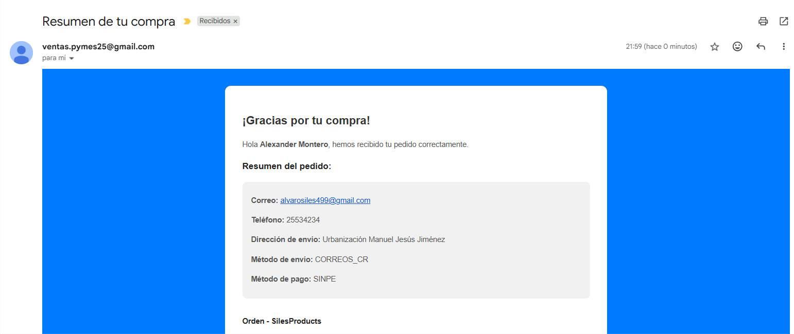

Automated order tracking with email notifications at each stage.

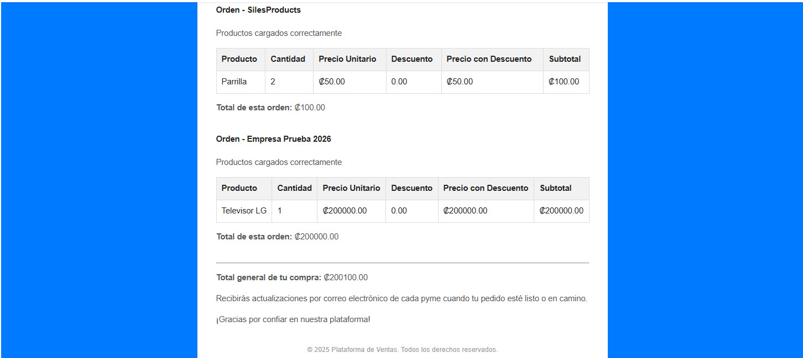

**Order Features:**
- Order creation and tracking
- Order status management
- Email confirmations
- Order history
- Invoice generation

---

## Installation

### Prerequisites

Before you begin, ensure you have the following installed:

- **Java JDK 21 or higher**
- **Gradle** (or use the included Gradle Wrapper)
- **Node.js 18+** and **npm**
- **Docker** and **Docker Compose** (for containerized deployment)
- **PostgreSQL** (if running without Docker)
- **Apache Kafka** and **Zookeeper** (if running without Docker)
- **Git**

---

### Running Locally

This setup uses Docker for databases, Kafka, and Zookeeper, while running the microservices and frontend locally.

#### Step 1: Clone the Repository

```bash
git clone https://github.com/Alvaro499/sales-microservices.git
cd sales-microservices
```

#### Step 2: Start Infrastructure Services

Navigate to the backend directory and start the infrastructure services (PostgreSQL, Kafka, Zookeeper) using Docker:

```bash
cd backend
docker-compose -f docker-compose.local.yml up -d
```

This will start:
- **PostgreSQL** databases for authentication and sales services
- **Zookeeper** on port 2181
- **Kafka** on port 9092

**Verify containers are running:**

```bash
docker ps
```

#### Step 3: Start Eureka Service Registry

Eureka must be started first as all other services register with it.

```bash
# From backend directory
cd eureka
gradlew.bat bootRun
# On Linux/Mac use: ./gradlew bootRun
```

Wait until Eureka is fully started (usually shows "Started Eureka..." in console).

**Eureka Dashboard:** http://localhost:8761

#### Step 4: Start API Gateway

In a new terminal:

```bash
# From backend directory
cd gateway
gradlew.bat bootRun
```

**Gateway URL:** http://localhost:8080

#### Step 5: Start Authentication Service

In a new terminal:

```bash
# From backend directory
cd authentication-service
gradlew.bat bootRun
```

The service will automatically create its database schema on first run.

#### Step 6: Start Sales Service (Ventas)

In a new terminal:

```bash
# From backend directory
cd ventas-back
gradlew.bat bootRun
```

#### Step 7: Start Email Service

In a new terminal:

```bash
# From backend directory
cd email-service
gradlew.bat bootRun
```

#### Step 8: Start Frontend Application

In a new terminal:

```bash
# From project root
cd frontend/front-end
npm install
npm run dev
```

**Frontend URL:** http://localhost:5173

---

### Running with Docker

Run the entire application stack using Docker Compose.

#### Step 1: Clone the Repository

```bash
git clone https://github.com/Alvaro499/sales-microservices.git
cd sales-microservices/backend
```

#### Step 2: Build and Start All Services

```bash
docker-compose up -d --build
```

This will:
- Build all microservice Docker images
- Start all containers (databases, Kafka, Zookeeper, microservices)
- Set up the network for inter-service communication

#### Step 3: Verify Services

Check that all containers are running:

```bash
docker-compose ps
```

**Access Eureka Dashboard:** http://localhost:8761

**Access API Gateway:** http://localhost:8080

#### Step 4: Start Frontend

The frontend typically runs separately:

```bash
cd ../frontend/front-end
npm install
npm run dev
```

Or build for production:

```bash
npm run build
npm run preview
```

#### Step 5: Stop All Services

```bash
docker-compose down
```

To remove volumes as well:

```bash
docker-compose down -v
```

---

### Database Access (Development)

When running locally with Docker Compose, you can access the PostgreSQL databases directly:

**Authentication Database:**
```bash
docker exec -it ventas-backend-auth-db-1 psql -U authuser -d authdb
```

**Sales Database:**
```bash
docker exec -it ventas-backend-ventas-db-1 psql -U ventasuser -d ventasdb
```

**Common PostgreSQL commands:**
- `\dt` - List tables
- `\d table_name` - Describe table structure
- `\q` - Quit psql
- `SELECT * FROM table_name;` - Query data

---

## Microservices Overview

### Eureka Service Registry

**Port:** 8761  
**Purpose:** Service discovery and registration  
**Technology:** Spring Cloud Netflix Eureka

All microservices register themselves with Eureka on startup, enabling dynamic service discovery.

---

### API Gateway

**Port:** 8080  
**Purpose:** Single entry point, routing, load balancing  
**Technology:** Spring Cloud Gateway

Routes all client requests to appropriate microservices. Handles cross-cutting concerns like CORS.

---

### Authentication Service

**Port:** 8081  
**Database:** PostgreSQL (authdb)  
**Purpose:** User management, authentication, authorization  
**Technology:** Spring Boot, Spring Security, JWT

Handles user registration, login, email verification, password recovery, and JWT token generation.

---

### Sales Service (Ventas)

**Port:** 8082  
**Database:** PostgreSQL (ventasdb)  
**Purpose:** Product, order, and inventory management  
**Technology:** Spring Boot, JPA/Hibernate

Core business logic for e-commerce operations including product catalog, orders, and inventory.

---

### Email Service

**Port:** 8084  
**Purpose:** Asynchronous email notifications  
**Technology:** Spring Boot, Kafka, JavaMail

Consumes events from Kafka and sends emails for verification, password recovery, and order updates.

---

### Frontend Application

**Port:** 5173 (dev)  
**Purpose:** User interface for customers and admins  
**Technology:** React, TypeScript, Material-UI

Responsive web application providing the complete user experience for both customers and PyME administrators.

---

## Contact

**Alvaro Siles**

- GitHub: [@Alvaro499](https://github.com/Alvaro499)
- Email: alvarosiles499@gmail.com
- Project Repository: [https://github.com/Alvaro499/sales-microservices.git](https://github.com/Alvaro499/sales-microservices.git)

[(back to top)](#pyme-management-platform-and-e-commerce--microservices-architecture)

---
